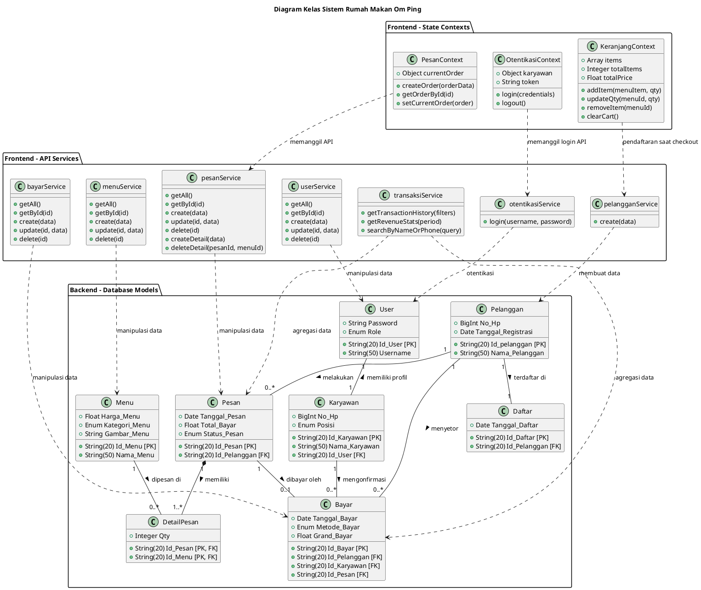
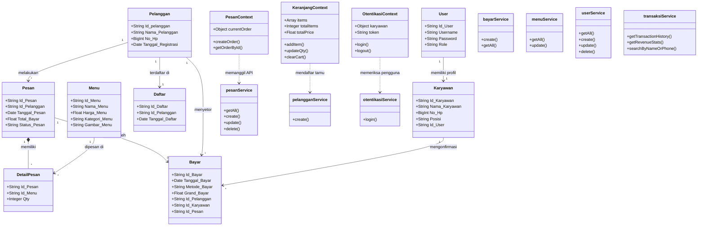

# Dokumentasi Class Diagram (Bahasa Indonesia) - Rumah Makan Om Ping

Dokumen ini berisi diagram kelas (class diagram) dari sistem **Rumah Makan Om Ping** yang mencakup arsitektur **Frontend** (React + Context + Services) dan **Backend** (Sequelize Models) dengan penamaan bahasa Indonesia yang disesuaikan dengan Use Case Diagram.

---

## 1. PlantUML Source Code

Anda dapat menyalin kode di bawah ini dan menempelkannya ke editor PlantUML (seperti [PlantText](https://www.planttext.com/) atau ekstensi VS Code PlantUML) untuk merender gambar diagram secara penuh.

---

## 2. Diagram Visual (Mermaid)

Di bawah ini adalah representasi diagram kelas yang secara otomatis dirender secara visual langsung oleh browser/IDE Anda menggunakan format Mermaid:

